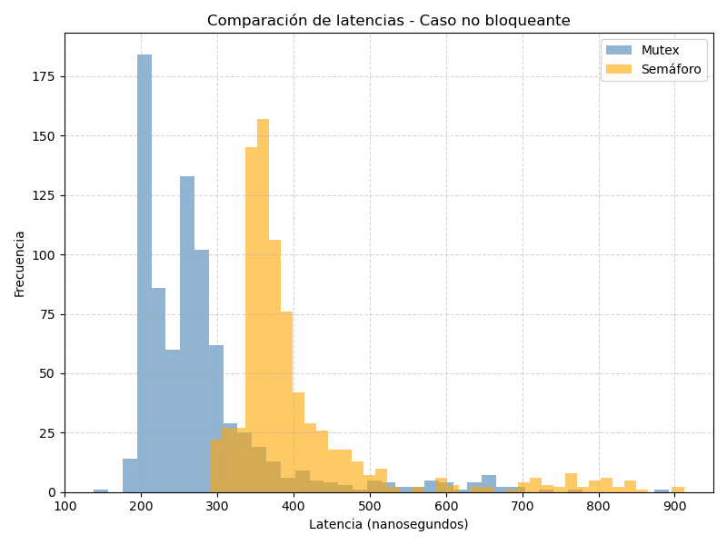

# Estudio-de-latencias-de-mutex-y-semaforos

## Estudio de latencias: Mutex vs Semáforo (caso no bloqueante)

Se realizó una medición de latencias en GNU/Linux utilizando el código de referencia del repositorio:  
[https://gitlab.eif.urjc.es/roberto.calvo/sdc/-/blob/main/01-mutex/mutex_latency.c](https://gitlab.eif.urjc.es/roberto.calvo/sdc/-/blob/main/01-mutex/mutex_latency.c)

En esta prueba se utilizó la opción no bloqueante, es decir, sin concurrencia (un único hilo). La ejecución tuvo una duración aproximada de 1 minuto, generando un conjunto de muestras de latencia para los accesos a mutex y semáforos.

### Resultados estadísticos

--- Mutex ---
Min: 138 ns

Max: 892 ns

Promedio: 278.20 ns

Desv. estándar: 95.75 ns

--- Semáforo ---
Min: 290 ns

Max: 912 ns

Promedio: 405.01 ns

Desv. estándar: 108.80 ns

### Histograma comparativo

### Comentario

En la gráfica se ve que el mutex es más rápido que el semáforo. Las latencias del mutex están casi todas entre **200 y 300 ns**, mientras que el semáforo va un poco más lento, alrededor de **400 ns** y con más variación. Tiene sentido, porque los semáforos suelen tener más trabajo interno del sistema (más cosas que hacer en el kernel).

Aun así, los dos son bastante rápidos y funcionan bien cuando no hay varios hilos compitiendo.

